# 自建Docker镜像代理加速
Docker Hub 是一个容器注册表，专为开发人员和开源贡献者构建，用于查找、使用和共享其容器镜像。但从2023年5月中旬，hub.docker.com “不知” 何种原因国内均无法正常访问了，好在国内各大高校和容器技术社区提供了加速站点，国内开发者还是能获取到各种镜像。

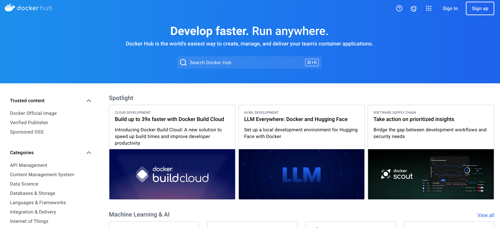

好景不长，今年6月份各大高校和容器技术社区由于一些不可抗因素，纷纷关闭了镜像加速站点，这极大地影响了工作效率和开发进度。

为了继续使用DockerHub获取各种各样的镜像数据，我们可以尝试自己搭建代理，中转对Docker官方镜像仓库的请求，解决一些访问限制和加速访问的问题。下文介绍基于Cloudflare Workers的Docker镜像代理部署和使用。

## 部署DockerHub代理
### fork仓库CF-Workers-docker.io
将CF-Workers-docker.io(https://github.com/cmliu/CF-Workers-docker.io)fork到自己仓库。

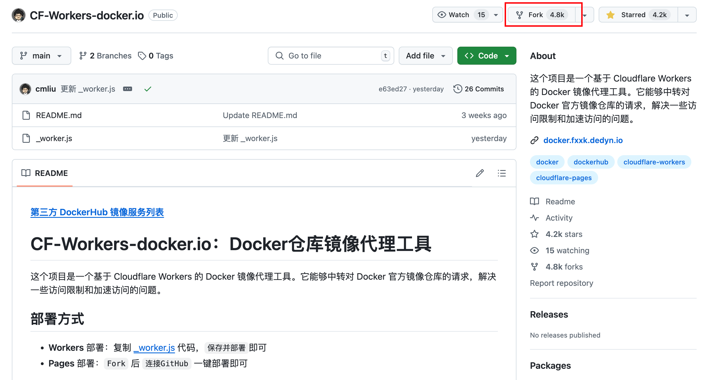

### 部署到Cloudflare的pages中
- 创建pages应用

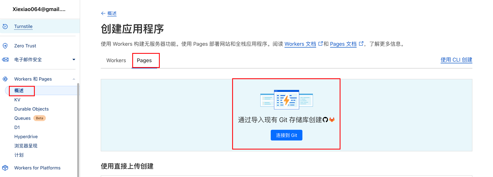

- 连接GitHub

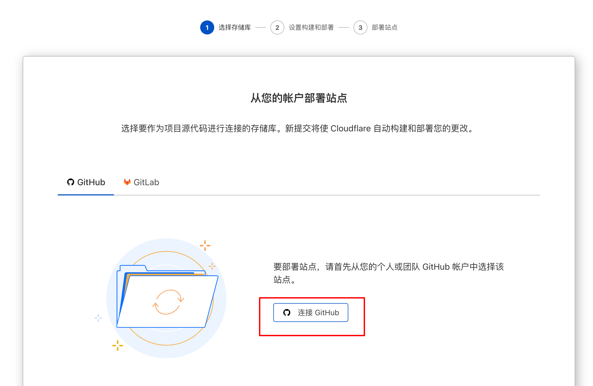

- 选择存储库部署

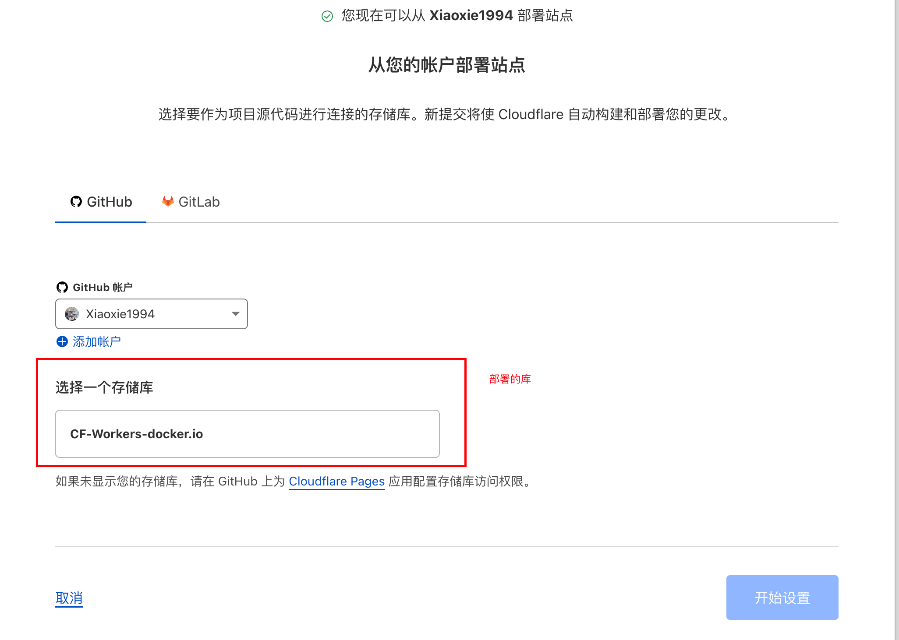

- 等待部署完成

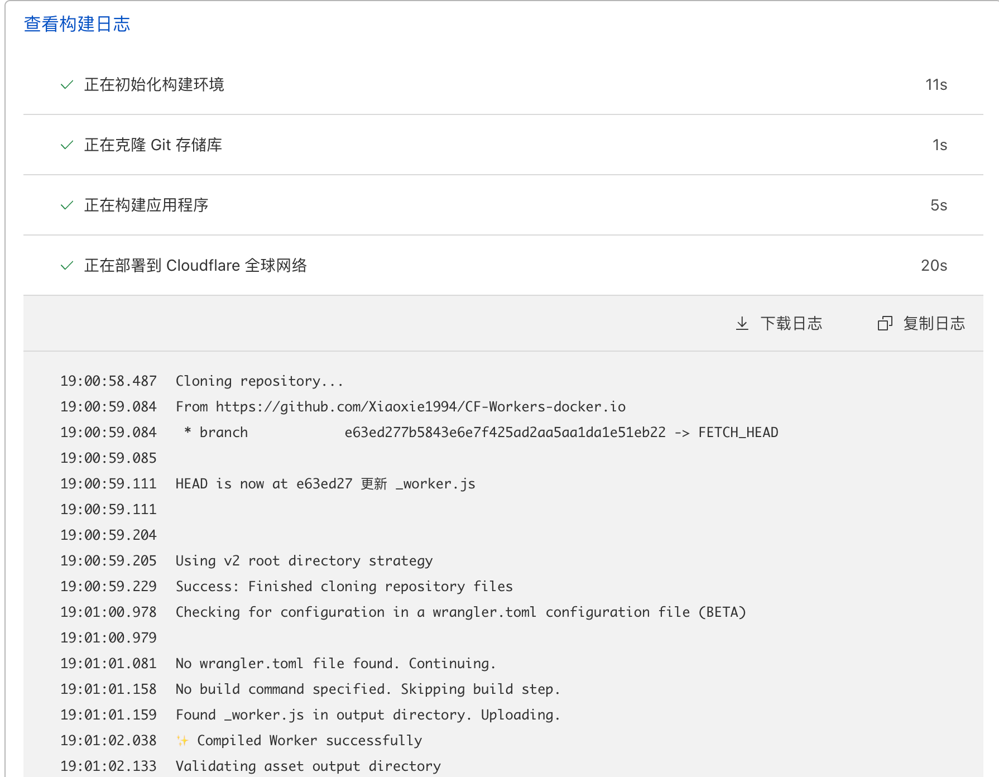

- 获取镜像代理域名

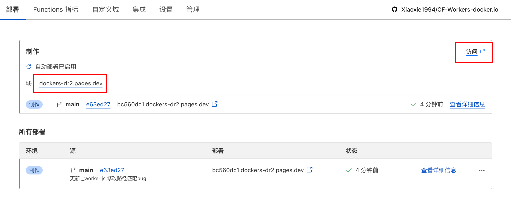

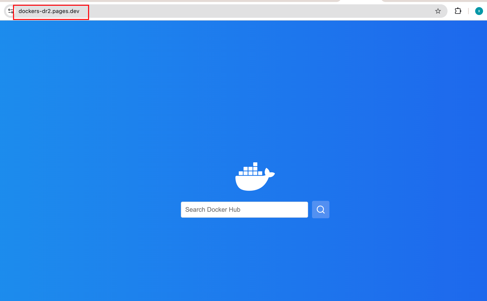

- 自定义域名（可选）

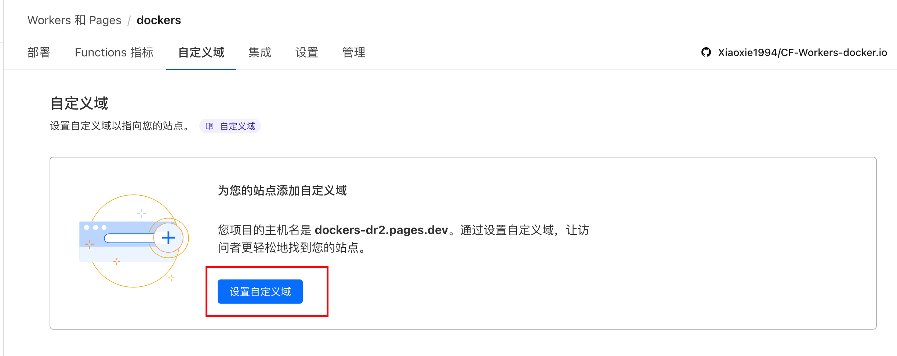


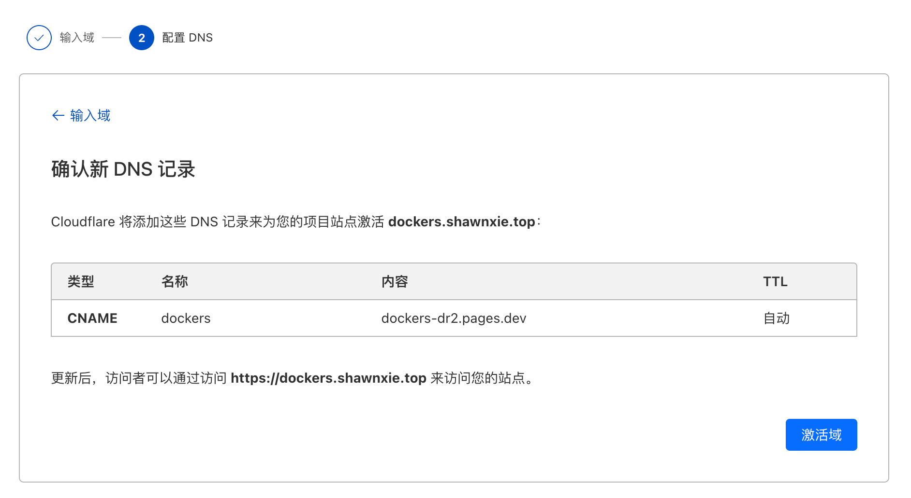

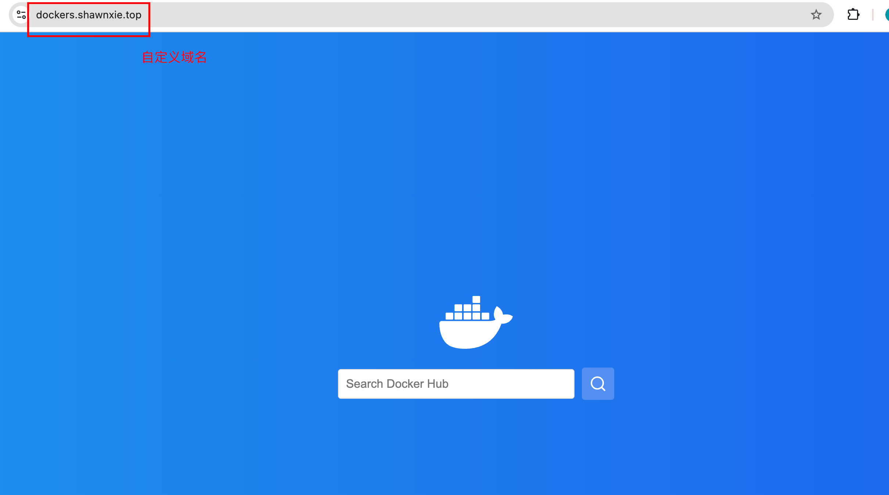

## 如何配置镜像加速
### 官方镜像路径前加域名
```bash
docker pull dockers.shawnxie.top/library/nginx:latest
```

### 设置镜像加速docker配置
修改文件 /etc/docker/daemon.json（如果不存在则创建）
```bash
sudo mkdir -p /etc/docker
sudo tee /etc/docker/daemon.json <<-'EOF'
{
  "registry-mirrors": ["https://dockers.shawnxie.top"]  # 请替换为您自己的Worker自定义域名
}
EOF
sudo systemctl daemon-reload
sudo systemctl restart docker
```
可以执行 docker info命令，如果从结果中看到了如下内容，说明配置成功。
```Bash
docker info
---
Registry Mirrors:
    https://dockers.shawnxie.top
```


