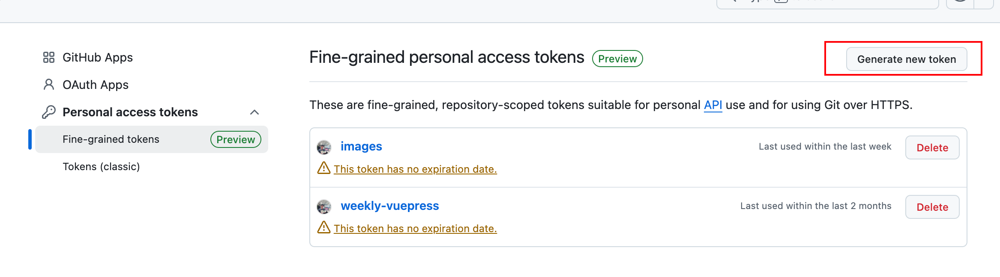
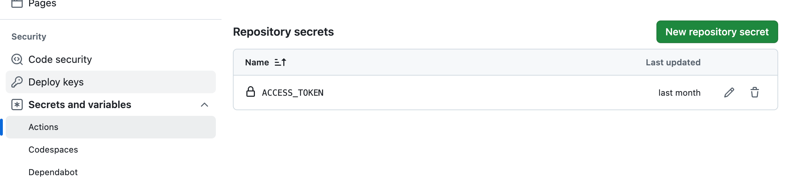

# 静态页面速搭教程
## 前言
为什么需要静态页面，静态页面的好处。

## 工具选型
- [vuepress]()
好用的静态网站构建工具，主题使用vuepress-theme-hope。

- [Github Pages]()
通过Github Action部署到Github Pages。

## 搭建步骤
1. vuepress搭建

参考[指南](https://theme-hope.vuejs.press/zh/)

2. 部署到Github Pages

申请secrets用于操作Github。

配置环境变量。

编写部署脚本。

见[脚本](../../.github/workflows/deploy.yml)

Github配置Actions

自定义域名

